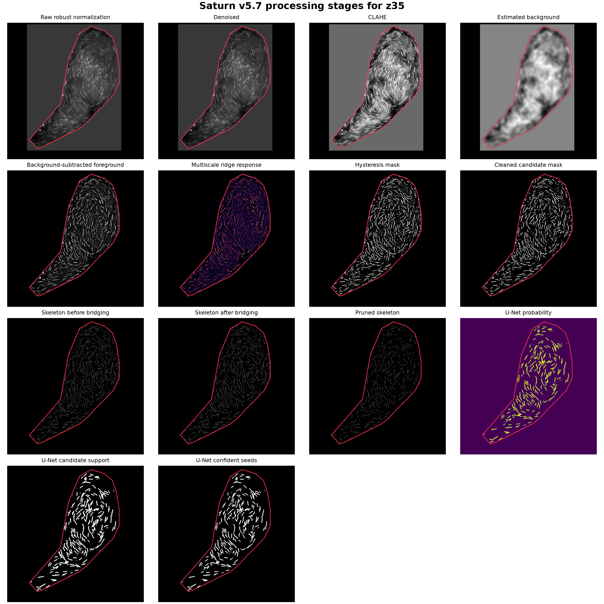
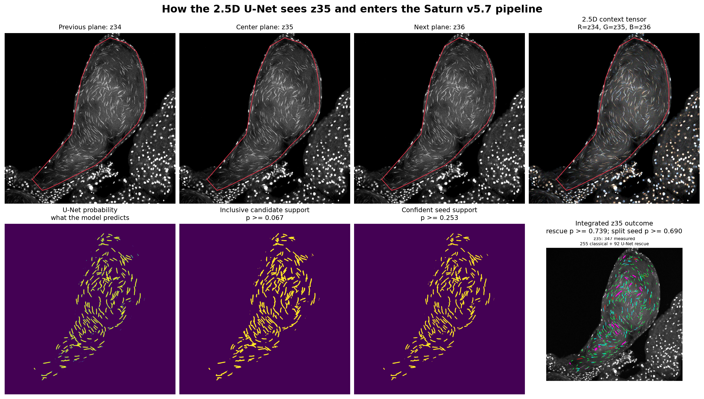
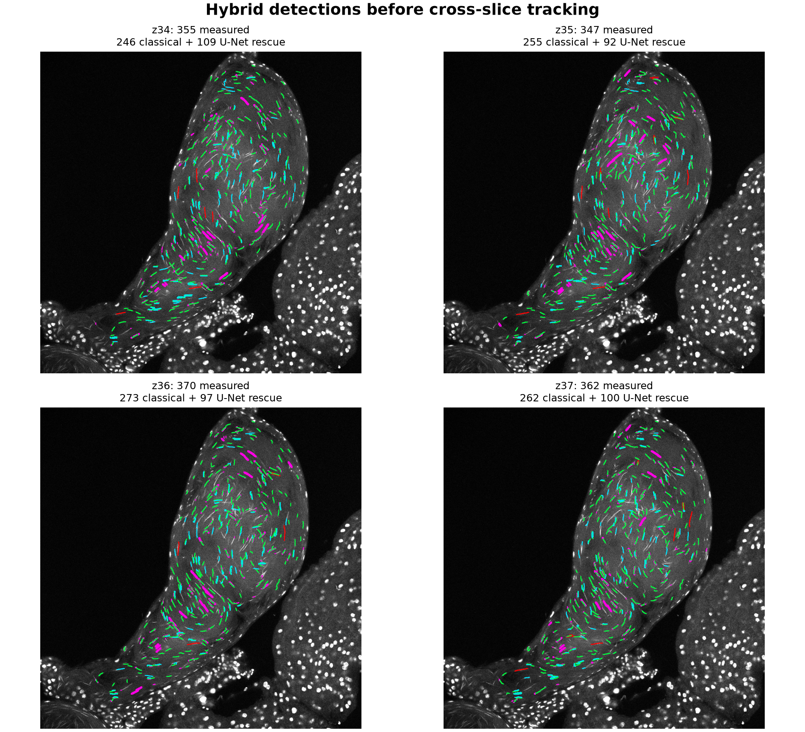
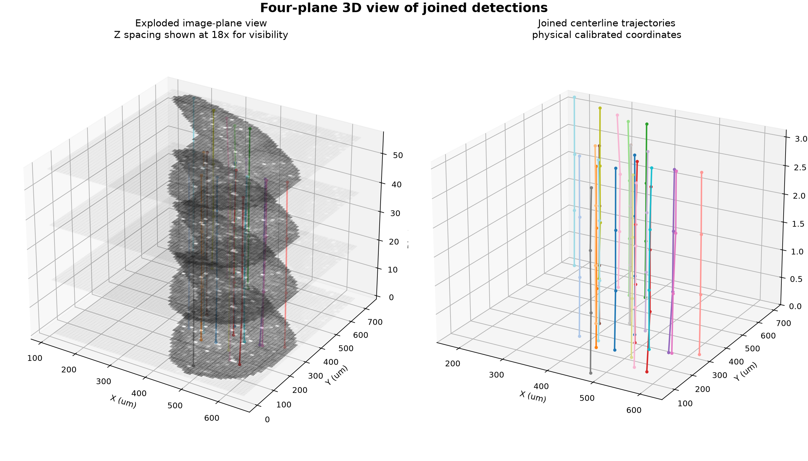

# Saturn v5.7 Sperm Nuclei Segmentation

Saturn v5.7 is the active Drosophila sperm-nucleus analysis pipeline. It
combines ROI-aware classical segmentation, optional 2.5D U-Net probability
support, cross-slice tracking, morphology measurements, quality-control
populations, and multi-sample study management. The study manager supports
explicit WT/mutant group assignment, flexible Z-stack filenames, and
non-destructive canonical dataset organization.

## Visual Workflow

Saturn first restricts analysis to the saved specimen ROI. Within that ROI it
normalizes and denoises each slice, enhances elongated ridges, builds and
cleans candidate masks, and reduces candidates to measurable centerlines.



The optional 2.5D U-Net receives the previous, center, and next Z planes as
three input channels. Its continuous probability map supplies candidate
support and confident seeds; it does not directly replace Saturn's measurement
or quality-control stages.



### Overlay Cues

- **Green:** accepted Saturn classical detection.
- **Cyan:** accepted U-Net rescue detection.
- **Magenta, orange, or red:** U-Net-positive candidate rejected by a rescue
  gate, such as a short fragment or implausible topology.
- **Red ROI outline:** analysis boundary; pixels outside it do not contribute
  to preprocessing thresholds or detections.

Overlay thickness is display-only. Counts, lengths, widths, and tracking use
the underlying masks and centerlines rather than the rendered colored lines.



After 2D measurement, detections can be linked across adjacent Z planes using
calibrated XY and Z distances. The resulting track table supports 3D length,
Z-span, Z-covered thickness, tortuosity, and approximate volume summaries.



These panels are illustrative outputs from one development stack. They explain
the computation and visual cues; they are not a genotype comparison, accuracy
benchmark, or substitute for validation on new acquisition conditions.

## Run the GUI

From PowerShell:

```powershell
Set-Location "C:\Users\dmishra\Desktop\sperm_project"
.\.venv\Scripts\Activate.ps1
python .\sperm_segmentation_saturnv5.7.py --gui
```

Launching without arguments also opens the GUI:

```powershell
python .\sperm_segmentation_saturnv5.7.py
```

## Active Components

- `sperm_segmentation_saturnv5.7.py`: GUI, segmentation, tracking, reporting,
  ROI normalization, and multi-sample study manager with group assignment and
  canonical dataset organization.
- `utils/tune_parameters_Saturnv5_7.py`: v5.7 segmentation and U-Net rescue
  tuner.
- `utils/saturn_unet25d_bridge.py`: lazy checkpoint loading and tiled U-Net
  probability inference.
- `unet25d/`: dataset preparation, model training, inference, and threshold
  review tools.
- `parameter_tuning_results_v5_7/`: reviewed v5.7 tuning outputs.
- `docs/v5_7_illustrated_workflow/`: illustrated workflow source assets.
- `Saturn_V5.7_Illustrated_Analysis_Workflow_FINAL.docx`: readable workflow
  report.

## Recommended Workflow

1. Load one image stack or open the multi-sample study manager.
2. Draw or load a specimen-specific ROI and confirm its alignment.
3. Confirm XY and Z calibration from microscope metadata.
4. Load the reviewed v5.7 parameters and U-Net checkpoint when using hybrid
   inference.
5. Run segmentation and cross-slice tracking.
6. Review the green `analysis_overlays`, normalization warnings, and
   specimen-level outputs before biological comparison. Consult technical QC
   only when troubleshooting.

`Run Slice` is a visual 2D candidate preview, not a unique-nucleus count.
Completed stack runs write `analysis_summary.csv` and `analysis_summary.json`
with one included estimated-nucleus population. The primary outputs report
count, length, width, length-to-width ratio, effective thickness, tortuosity,
Z span, and slices detected. Detailed raw detections, U-Net provenance,
rejections, and track flags remain available under technical QC without
defining additional biological populations.

Do not tune parameters toward a desired genotype count or morphology. Tune and
validate without using biological-group outcomes.

## Development

Install the core environment with:

```powershell
python -m venv .venv
.\.venv\Scripts\Activate.ps1
python -m pip install -r requirements.txt
```

Run the active tests with:

```powershell
python -m pytest -q
```

Historical Saturn versions, old tuning runs, build outputs, and experimental
AI pilots are preserved under `archive/`. See `PROJECT_LAYOUT.md` and
`archive/README.md`.
